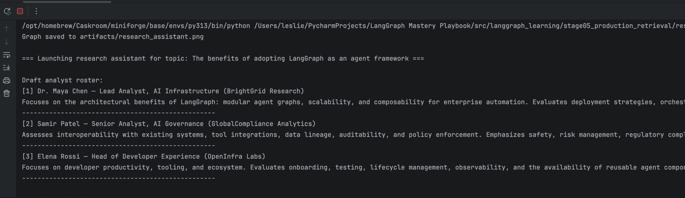
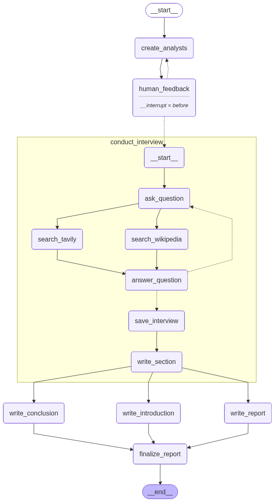

# LangGraph Mastery Playbook

[中文版本](README.zh.md)

   

**Ship LangGraph agents from day one with a runnable, stage-based curriculum.**

> 🚀 Kick off with `uv run python -m src.langgraph_learning.stage01_foundations.quickstart` to ping an LLM and run a Tavily search tool directly from your terminal.

## TL;DR

- Follow a six-stage path that upgrades your LangGraph skills from graph basics to production retrieval systems.
- Every lesson is a pure-Python module with `main()` plus artifacts for graphs, checkpoints, and streaming logs.
- Works with OpenAI, OpenRouter, DeepSeek, or any compatible endpoint through `utils.create_llm`.
- Designed for builders who prefer reproducible scripts over notebooks—ideal for demos, CI, or team onboarding.

## Quickstart Demo

Run the Stage 03 map-reduce lesson to see LangGraph parallelism and structured outputs in action:

```bash
uv run python -m src.langgraph_learning.stage05_advanced_memory_systems.agent_with_deep_research
```

Example output:


The lesson also saves a graph diagram you can reference or share:



## Why This Project?

- **Script-first tutorials.** Most LangGraph examples online live in Jupyter notebooks; great for reading, not ideal for reuse. Every tutorial here is a standalone Python module with a `main()` entry point and stage-specific helpers.
- **Structured learning path.** Lessons are grouped into numbered stages so you always know what to study next—from Stage 01 foundational graph skills to Stage 06 production retrieval pipelines.
- **Consistent tooling.** Shared utilities handle graph visualization, environment checks, TrustCall inspection, and common math tools. Less boilerplate, more focus on concepts.
- **Automation friendly.** Because everything is pure Python, you can run the entire course headlessly, integrate it into CI pipelines, or extend it with your own tests.

## Learning Roadmap

| Stage | Focus & Flagship Lesson | Skill Gains | Est. Time |
| --- | --- | --- | --- |
| `stage01_foundations` → `quickstart` | Build your first LangGraph agent that chats and calls a Tavily search tool. | Validate credentials early, invoke chat models, and integrate third-party tools. | ~45 min |
| `stage02_memory_basics` → `agent_with_short_term_memory` | Add conversation memory backed by checkpoints and persistence. | Configure `MemorySaver`, reuse prior turns, and checkpoint graph state between runs. | ~60 min |
| `stage03_state_management` → `agent_with_parallel_nodes` | Fan out work with map-reduce and structured outputs. | Design typed state, parallelize nodes with `Send`, and synthesize results. | ~75 min |
| `stage04_operational_control` → `agent_with_interruption` | Debug and steer long-running graphs in real time. | Use breakpoints, streaming modes, history trimming, and trust-call inspection. | ~60 min |
| `stage05_advanced_memory_systems` → `trustcall_memory_agent` | Coordinate multiple memory types with structured extraction. | Manage user profiles, todos, and instructions with TrustCall extractors. | ~75 min |
| `stage06_production_systems` → `agent_with_deep_research` | Ship production-ready retrieval and synthesis workflows. | Blend parallel retrievers, merge context chunks, and add production guardrails. | ~90 min |

Every Python file begins with a “What You'll Learn / Lesson Flow” docstring so you can skim the topic before running it.

## Getting Started

We use [uv](https://docs.astral.sh/uv/) for dependency management; it can still export a traditional
`requirements.txt` when needed.

```bash
git clone https://github.com/leslieo2/LangGraph-Mastery-Playbook
cd LangGraph-Mastery-Playbook
uv venv              # create a virtual environment
source .venv/bin/activate  # Windows: .venv\Scripts\activate
uv pip install .
```

> Need a pinned export? Run `uv pip compile requirements.in -o requirements.txt` to generate one.

### Environment Variables

Set the API keys required for the lessons you plan to run:

```bash
export OPENAI_API_KEY="sk-..."        # Required for all LLM demos
export TAVILY_API_KEY="tvly-..."      # Needed for Stage 06 production systems
export LANGSMITH_API_KEY="ls-..."     # Optional, enables tracing in supported lessons
```

### LLM Provider Configuration

To switch models/providers, just edit the `.env` file.

Example switch to OpenRouter:

```dotenv
LLM_PROVIDER=openrouter
OPENROUTER_API_KEY=sk-your-openrouter-key
OPENROUTER_MODEL=anthropic/claude-3-haiku
OPENROUTER_TEMPERATURE=0.2
```

### Running Lessons

Each script is executable via `python -m` (uv users can also run `uv run ...`):

```bash
# Stage 01 examples
python -m src.langgraph_learning.stage01_foundations.quickstart
python -m src.langgraph_learning.stage01_foundations.agent_with_tool_call

# Stage 02 memory basics
python -m src.langgraph_learning.stage02_memory_basics.agent_with_short_term_memory

# Stage 04 operational control
python -m src.langgraph_learning.stage04_operational_control.agent_with_interruption

# Stage 05 advanced memory systems
python -m src.langgraph_learning.stage05_advanced_memory_systems.trustcall_memory_agent

# Stage 06 production systems
python -m src.langgraph_learning.stage06_production_systems.agent_with_deep_research
```

Most lessons generate a graph visualization (PNG) inside the module’s `artifacts/` directory. Streaming lessons print incremental updates; debugging lessons may prompt for manual approval.

## Comparing to Notebook-Heavy Tutorials

- **Reproducibility:** No hidden notebook state—each run starts from a clean `main()` function.
- **Version control friendly:** Diffs stay readable, and docstring summaries keep the narrative close to the code.
- **Integration ready:** Drop modules into CI, wrap them with pytest, or use them as templates for your own LangGraph services.

If you prefer notebooks, you can still adapt these scripts into notebooks, but this project intentionally emphasizes production-style workflows.

## Contributing

- Fork the repo, create a branch per feature or lesson improvement, and submit a PR.
- Run `black .` to keep formatting consistent before committing changes.
- Ensure `python -m compileall src` passes before opening a PR.
- Add a docstring summary to any new lesson so it aligns with the staged curriculum.

Happy agent building! 🎯

## Acknowledgements

- The structure and many lesson ideas draw inspiration from the excellent [Intro to LangGraph](https://academy.langchain.com/courses/take/intro-to-langgraph) course.
- The official [LangChain + LangGraph documentation](https://docs.langchain.com/) remains an invaluable reference while following these scripts.
