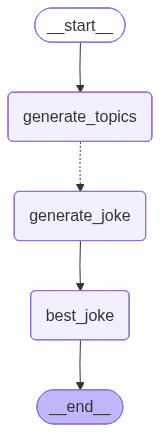

# LangGraph 精通实战手册

[English](README.md)

   

**用可运行的分阶段课程，从第一天起就能交付 LangGraph agent。**

> 🚀 运行 `uv run python -m src.langgraph_learning.stage01_foundations.quickstart`，直接在终端里体验 LLM 对话与 Tavily 搜索工具的联动。

## TL;DR

- 按照五个阶段循序渐进，从图基础一路练到生产级检索与综合。
- 每一堂课都是带 `main()` 的纯 Python 模块，附带图谱、检查点和流式日志等产物。
- 借助 `utils.create_llm` 统一管理 OpenAI、OpenRouter、DeepSeek 等兼容服务。
- 面向偏爱脚本的构建者——适合演示、CI 集成或团队入门培训。

## 快速体验

试试 Stage 03 的 Map-Reduce 课程，感受 LangGraph 的并行处理和结构化输出：

```bash
uv run python -m src.langgraph_learning.stage03_state_architecture.map_reduce_joke_selector
```

示例输出（截取）：

```text
=== Map-Reduce Demo: animals ===
{'generate_topics': {'subjects': ['sea otters', 'rescue dogs', 'urban pigeons']}}
{'generate_joke': {'jokes': ['What do sea otters call a fancy party? A kelp gala!', ...]}}
{'best_joke': {'best_selected_joke': 'Why did the rescue dog bring a ladder? To reach his high paws!'}}
Winning joke: Why did the rescue dog bring a ladder? To reach his high paws!
```

课程还会在 `artifacts/` 目录生成可复用的图谱：



## 项目亮点

一个开源、以代码为先的 LangGraph 自学课程。我们摒弃松散的 Notebook 片段，将每堂课都整理成可直接运行的 Python 脚本，配有明确的学习目标、清晰的课程流程说明，以及统一维护的工具库。由此得到的学习路径可复现、易于测试，既适合快速上手，也能扩展到生产级的编排实践。

- **脚本优先的教程。** 大多数 LangGraph 示例都放在 Jupyter Notebook 里——读起来方便，复用起来麻烦。本项目的每个示例都是带 `main()` 入口的独立 Python 模块，并按阶段提供专属辅助工具。
- **有结构的学习路线。** 课程分为编号的阶段，从 Stage 01 基础图技能到 Stage 05 生产级检索与综合，每一步都知道接下来该学什么。
- **一致的工具体系。** 共享工具负责图形可视化、环境检查、TrustCall 分析，以及常用的数学工具。减少样板代码，把时间留给核心概念。
- **便于自动化。** 全部基于纯 Python，你可以无界面运行整套课程，集成到 CI 流水线，或扩展成自己的测试。

## 学习路线

| Stage | 焦点 & 代表课程 | 核心收获 | 预计用时 |
| --- | --- | --- | --- |
| `stage01_foundations` → `quickstart` | 构建会聊天并调用 Tavily 搜索工具的首个 LangGraph agent。 | 提前验证凭证、调用聊天模型、集成第三方工具。 | ~45 分钟 |
| `stage02_memory_and_personalization` → `agent_with_memory` | 为对话代理加入带持久化的检查点记忆。 | 配置 `MemorySaver`、续写历史对话、在运行间保存图状态。 | ~60 分钟 |
| `stage03_state_architecture` → `map_reduce_joke_selector` | 使用 Map-Reduce 并行生成并结构化整理答案。 | 设计类型化状态、借助 `Send` 并行节点、综合多路输出。 | ~75 分钟 |
| `stage04_operational_control` → `breakpoints` | 实时调试并掌控长流程图。 | 运用断点、流式模式、历史裁剪与 TrustCall 检视。 | ~60 分钟 |
| `stage05_production_retrieval` → `parallel_retrieval` | 交付生产级检索与综合工作流。 | 并联检索器、合并上下文片段、添加上线防护。 | ~90 分钟 |

每个 Python 文件开头都有 “What You'll Learn / Lesson Flow” 的文档字符串，运行前即可快速了解内容。

## 快速开始

我们使用 [uv](https://docs.astral.sh/uv/) 管理依赖；如有需要，仍然可以导出传统的 `requirements.txt`。

```bash
git clone https://github.com/leslieo2/LangGraph-Mastery-Playbook
cd LangGraph-Mastery-Playbook
uv venv                    # 创建虚拟环境
source .venv/bin/activate  # Windows: .venv\Scripts\activate
uv pip install .
```

> 需要锁定依赖？执行 `uv pip compile requirements.in -o requirements.txt` 即可生成。

### 环境变量

根据要运行的课程设置需要的 API Key：

```bash
export OPENAI_API_KEY="sk-..."        # 所有 LLM 演示都需要
export TAVILY_API_KEY="tvly-..."      # Stage 05 并行检索示例需要
export LANGSMITH_API_KEY="ls-..."     # 可选，启用支持课程的链路追踪
```

### LLM 模型 / 供应商配置

所有课程都通过 `src.langgraph_learning.utils.create_llm` 来构造聊天模型，该函数支持多家兼容 OpenAI 协议的供应商。默认使用 OpenAI 的 `gpt-5-nano`，也可以通过以下环境变量切换：

- `LLM_PROVIDER`：可选 `openai`（默认）、`openrouter`、`deepseek`。
- `LLM_MODEL`：覆盖默认模型名称，例如 `gpt-4o-mini` 或 `openrouter/anthropic/claude-3-haiku`。
- `LLM_TEMPERATURE`：可选的浮点数，覆盖采样温度。
- `LLM_API_KEY`：任何供应商的通用兜底密钥（若未设置对应供应商的专属变量）。
- 供应商专属密钥 / Base URL：
  - OpenRouter：`OPENROUTER_API_KEY`，可选 `OPENROUTER_BASE_URL`（默认 `https://openrouter.ai/api/v1`）。
  - DeepSeek：`DEEPSEEK_API_KEY`，可选 `DEEPSEEK_BASE_URL`（默认 `https://api.deepseek.com/v1`）。
  - OpenAI：`OPENAI_API_KEY`，可选 `OPENAI_BASE_URL`。

例如切换到 OpenRouter：

```bash
export LLM_PROVIDER="openrouter"
export OPENROUTER_API_KEY="or-..."
export LLM_MODEL="openrouter/anthropic/claude-3-haiku"
```

### 运行课程脚本

每个脚本都可以通过 `python -m` 运行（使用 uv 时也可用 `uv run ...`）：

```bash
# Stage 01 示例
python -m src.langgraph_learning.stage01_foundations.quickstart
python -m src.langgraph_learning.stage01_foundations.tool_calling_chain

# Stage 02 记忆系统
python -m src.langgraph_learning.stage02_memory_and_personalization.agent_with_memory
python -m src.langgraph_learning.stage02_memory_and_personalization.trustcall_memory_agent

# Stage 04 调试与监控
python -m src.langgraph_learning.stage04_operational_control.breakpoints
```

多数课程会在对应模块的 `artifacts/` 目录下生成图形化的 PNG；流式课程会输出增量信息；调试课程可能会提示手动确认。


## 与 Notebook 教程的差异

- **可复现性。** 不依赖 Notebook 隐式状态——每次运行都从干净的 `main()` 开始。
- **更适合版本管理。** Diff 清晰，课程梗概就写在文档字符串里，代码旁边就有叙述。
- **易于集成。** 可以直接丢进 CI、用 pytest 包装、或者改造成自己的 LangGraph 服务模板。

如果你更喜欢 Notebook，也可以根据这些脚本改写，但本项目有意强调生产式的工作流程。

## 参与贡献

- Fork 仓库，为每个功能或课程改进创建独立分支，再提交 PR。
- 提交之前运行 `black .`，保持代码风格一致。
- 在提交 PR 前确保 `python -m compileall src` 可以通过。
- 新增课程时记得添加文档字符串概要，以便保持阶段化的学习体验。

玩转agent，尽情享受！🎯

## 致谢

- 本项目的结构和许多课程思路，灵感来自出色的 [Intro to LangGraph](https://academy.langchain.com/courses/take/intro-to-langgraph) 课程。
- 官方的 [LangChain + LangGraph 文档](https://docs.langchain.com/) 是跟随脚本学习时不可或缺的参考资料。
