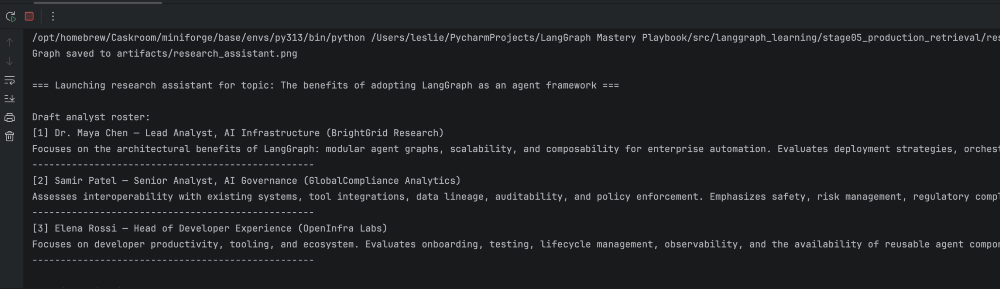
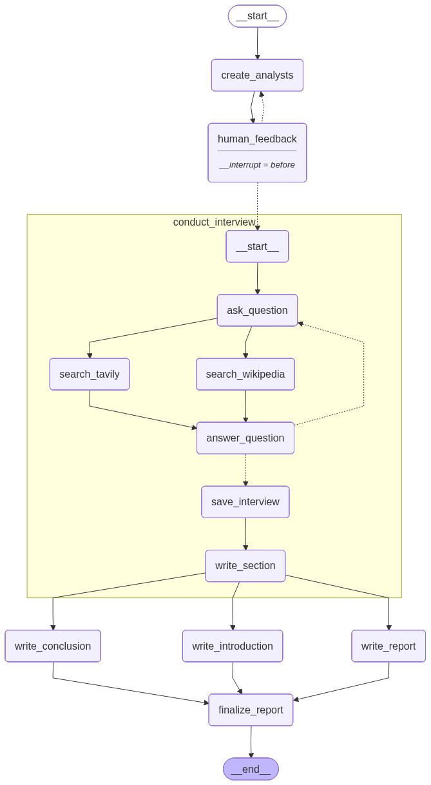

# LangGraph 精通实战手册

[English](README.md)

   

**用可运行的分阶段课程，从第一天起就能交付 LangGraph agent。**

> 🚀 运行 `uv run python -m src.langgraph_learning.stage01_foundations.quickstart`，直接在终端里体验 LLM 对话与 Tavily 搜索工具的联动。

## TL;DR

- 按照六个阶段循序渐进，从图基础一路练到生产级检索与综合。
- 每一堂课都是带 `main()` 的纯 Python 模块，附带图谱、检查点和流式日志等产物。
- 借助 `utils.create_llm` 统一管理 OpenAI、OpenRouter、DeepSeek 等兼容服务。
- 面向偏爱脚本的构建者——适合演示、CI 集成或团队入门培训。

## 快速体验

试试 Stage 06 的 deep research 课程，感受 LangGraph 的并行处理和结构化输出：

```bash
uv run python -m src.langgraph_learning.stage06_production_systems.agent_with_deep_research
```

示例输出：



课程还会在 `artifacts/` 目录生成可复用的图谱：



## 项目亮点

一个开源、以代码为先的 LangGraph 自学课程。我们摒弃松散的 Notebook 片段，将每堂课都整理成可直接运行的 Python 脚本，配有明确的学习目标、清晰的课程流程说明，以及统一维护的工具库。由此得到的学习路径可复现、易于测试，既适合快速上手，也能扩展到生产级的编排实践。

- **脚本优先的教程。** 大多数 LangGraph 示例都放在 Jupyter Notebook 里——读起来方便，复用起来麻烦。本项目的每个示例都是带 `main()` 入口的独立 Python 模块，并按阶段提供专属辅助工具。
- **有结构的学习路线。** 课程分为编号的阶段，从 Stage 01 基础图技能到 Stage 06 生产级检索与综合，每一步都知道接下来该学什么。
- **一致的工具体系。** 共享工具负责图形可视化、环境检查、结构化输出分析，以及常用的数学工具。减少样板代码，把时间留给核心概念。
- **便于自动化。** 全部基于纯 Python，你可以无界面运行整套课程，集成到 CI 流水线，或扩展成自己的测试。

## 相关项目

- [LieGraph](https://github.com/leslieo2/LieGraph) 展示了如何将本手册里的 LangGraph 模式扩展为完整的多智能体“谁是卧底”游戏，涵盖 UI、指标与生产级工具链。

## 学习路线

| Stage | 课程速览 | 核心收获 | 预计用时 |
| --- | --- | --- | --- |
| `stage01_foundations` → `quickstart`、`agent_with_tool_call`、`agent_with_router`、`agent_with_tool_router`、`agent_with_reactive_router`、`agent_with_structured_output` | 验证凭证、绑定工具、设计分支流程，练习响应式工具循环，并掌握结构化输出。 | 搭建 `MessagesState`、检测并执行工具调用、配置条件边、循环处理多轮工具回放、生成带验证的结构化数据。 | ~2.5 小时 |
| `stage02_memory_basics` → `agent_with_short_term_memory`、`agent_with_chat_summary`、`agent_with_external_short_term_memory` | 为对话代理叠加检查点、摘要与 SQLite 持久化。 | 配置 `MemorySaver`、组织摘要 reducer、在不改动核心逻辑的前提下切换持久化存储。 | ~2 小时 |
| `stage03_state_management` → `agent_with_parallel_nodes`、`agent_with_state_reducer`、`agent_with_multiple_state`、`agent_with_pydantic_schema_constrain`、`agent_with_subgraph`、`agent_with_subgraph_memory` | 掌握大型流程里的类型化状态、Reducer 与子图。 | 借助 `Send` 并行化、化解 Reducer 冲突、按节点隔离状态、为子图独立记忆。 | ~3 小时 |
| `stage04_operational_control` → `agent_with_interruption`、`agent_with_validation_loop`、`agent_with_tool_approval_interrupt`、`agent_with_stream_interruption`、`agent_with_dynamic_interruption`、`agent_with_durable_execution`、`agent_with_message_filter`、`agent_with_time_travel` | 演练联机调试、风控与运行记录排查。 | 注入断点、构建校验循环、封装副作用任务避免重复执行、掌控流式输出、裁剪历史、从过去运行分叉。 | ~3 小时 |
| `stage05_advanced_memory_systems` → `agent_with_structured_memory`、`agent_with_fact_collection`、`agent_with_long_term_memory`、`agent_with_multi_memory_coordination` | 构建多层结构化记忆与个性化流程。 | 抽取结构化档案、采集事实、撰写反思摘要、在多记忆间智能路由。 | ~3 小时 |
| `stage06_production_systems` → `agent_with_parallel_retrieval`、`agent_with_semantic_memory`、`agent_with_production_memory`、`agent_with_deep_research` | 交付生产级检索与研究流水线。 | 并联检索器、融合语义召回、配置外部检查点后端、运行深度研究工作流。 | ~3 小时 |

每个 Python 文件开头都有 “What You'll Learn / Lesson Flow” 的文档字符串，运行前即可快速了解内容。

## 快速开始

<details>
<summary><b>📋 安装说明（点击展开）</b></summary>

我们使用 [uv](https://docs.astral.sh/uv/) 管理依赖；如有需要，仍然可以导出传统的 `requirements.txt`。

```bash
git clone https://github.com/leslieo2/LangGraph-Mastery-Playbook
cd LangGraph-Mastery-Playbook
uv venv                    # 创建虚拟环境
source .venv/bin/activate  # Windows: .venv\Scripts\activate
uv pip install .
```

> 需要锁定依赖？执行 `uv pip compile requirements.in -o requirements.txt` 即可生成。

### 环境变量

根据要运行的课程设置需要的 API Key：

```bash
export OPENAI_API_KEY="sk-..."        # 所有 LLM 演示都需要
export TAVILY_API_KEY="tvly-..."      # Stage 06 生产系统示例需要
export LANGSMITH_API_KEY="ls-..."     # 可选，启用支持课程的链路追踪
```

> Stage 06 的生产级记忆课程还需要设置 `BACKEND_KIND`（`postgres`、`mongodb` 或 `redis`）、对应的 `BACKEND_URI`，以及在首次初始化时可选的 `BACKEND_INITIALIZE=true`。

### LLM 模型 / 供应商配置

要更换模型或供应商，只需要修改仓库根目录的 `.env` 文件。

示例：切换到 OpenRouter 并调整温度

```dotenv
LLM_PROVIDER=openrouter
OPENROUTER_API_KEY=sk-your-openrouter-key
OPENROUTER_MODEL=anthropic/claude-3-haiku
OPENROUTER_TEMPERATURE=0.2
```

</details>

<details>
<summary><b>🚀 运行课程脚本（点击展开）</b></summary>

每个脚本都可以通过 `python -m` 运行（使用 uv 时也可用 `uv run ...`）：

```bash
# Stage 01 示例
python -m src.langgraph_learning.stage01_foundations.quickstart
python -m src.langgraph_learning.stage01_foundations.agent_with_tool_call
python -m src.langgraph_learning.stage01_foundations.agent_with_router
python -m src.langgraph_learning.stage01_foundations.agent_with_tool_router
python -m src.langgraph_learning.stage01_foundations.agent_with_reactive_router
python -m src.langgraph_learning.stage01_foundations.agent_with_structured_output

# Stage 02 记忆基础
python -m src.langgraph_learning.stage02_memory_basics.agent_with_short_term_memory
python -m src.langgraph_learning.stage02_memory_basics.agent_with_chat_summary
python -m src.langgraph_learning.stage02_memory_basics.agent_with_external_short_term_memory

# Stage 03 状态管理
python -m src.langgraph_learning.stage03_state_management.agent_with_parallel_nodes
python -m src.langgraph_learning.stage03_state_management.agent_with_state_reducer
python -m src.langgraph_learning.stage03_state_management.agent_with_multiple_state
python -m src.langgraph_learning.stage03_state_management.agent_with_pydantic_schema_constrain
python -m src.langgraph_learning.stage03_state_management.agent_with_subgraph
python -m src.langgraph_learning.stage03_state_management.agent_with_subgraph_memory

# Stage 04 操作控制
python -m src.langgraph_learning.stage04_operational_control.agent_with_interruption
python -m src.langgraph_learning.stage04_operational_control.agent_with_validation_loop
python -m src.langgraph_learning.stage04_operational_control.agent_with_tool_approval_interrupt
python -m src.langgraph_learning.stage04_operational_control.agent_with_stream_interruption
python -m src.langgraph_learning.stage04_operational_control.agent_with_dynamic_interruption
python -m src.langgraph_learning.stage04_operational_control.agent_with_durable_execution
python -m src.langgraph_learning.stage04_operational_control.agent_with_message_filter
python -m src.langgraph_learning.stage04_operational_control.agent_with_time_travel

# Stage 05 高级记忆系统
python -m src.langgraph_learning.stage05_advanced_memory_systems.agent_with_structured_memory
python -m src.langgraph_learning.stage05_advanced_memory_systems.agent_with_fact_collection
python -m src.langgraph_learning.stage05_advanced_memory_systems.agent_with_long_term_memory
python -m src.langgraph_learning.stage05_advanced_memory_systems.agent_with_multi_memory_coordination

# Stage 06 生产系统
python -m src.langgraph_learning.stage06_production_systems.agent_with_parallel_retrieval
python -m src.langgraph_learning.stage06_production_systems.agent_with_semantic_memory
python -m src.langgraph_learning.stage06_production_systems.agent_with_production_memory
python -m src.langgraph_learning.stage06_production_systems.agent_with_deep_research
```

多数课程会在对应模块的 `artifacts/` 目录下生成图形化的 PNG；流式课程会输出增量信息；调试课程可能会提示手动确认。

</details>


## 与 Notebook 教程的差异

- **可复现性。** 不依赖 Notebook 隐式状态——每次运行都从干净的 `main()` 开始。
- **更适合版本管理。** Diff 清晰，课程梗概就写在文档字符串里，代码旁边就有叙述。
- **易于集成。** 可以直接丢进 CI、用 pytest 包装、或者改造成自己的 LangGraph 服务模板。

如果你更喜欢 Notebook，也可以根据这些脚本改写，但本项目有意强调生产式的工作流程。

## 参与贡献

- Fork 仓库，为每个功能或课程改进创建独立分支，再提交 PR。
- 提交之前运行 `black .`，保持代码风格一致。
- 在提交 PR 前确保 `python -m compileall src` 可以通过。
- 新增课程时记得添加文档字符串概要，以便保持阶段化的学习体验。

玩转agent，尽情享受！🎯

## LangGraph Studio 集成

本手册中的所有 agent 都可以在 **LangGraph Studio** 中进行可视化调试、测试和部署。详细设置说明请参阅 [STUDIO_SETUP.md](STUDIO_SETUP.md)。

**快速开始：**
```bash
langgraph dev
```
然后打开：`https://smith.langchain.com/studio/?baseUrl=http://127.0.0.1:2024`

## 致谢

- 本项目的结构和许多课程思路，灵感来自出色的 [Intro to LangGraph](https://academy.langchain.com/courses/take/intro-to-langgraph) 课程。
- 官方的 [LangChain + LangGraph 文档](https://docs.langchain.com/) 是跟随脚本学习时不可或缺的参考资料。

<details>
<summary><b>🔧 可选依赖与冒烟测试（点击展开）</b></summary>

部分生产级课程需要额外安装以下包：

- `langgraph-checkpoint-postgres`
- `langgraph-checkpoint-mongodb`
- `langgraph-checkpoint-redis`
- `langmem`

可以按需安装，例如：

```bash
uv pip install langgraph-checkpoint-postgres langgraph-checkpoint-mongodb \
  langgraph-checkpoint-redis langmem
```

准备好数据库后，运行冒烟脚本验证连接：

```bash
POSTGRES_URI=postgresql://... \
MONGODB_URI=mongodb://... \
REDIS_URI=redis://... \
uv run python scripts/production_memory_smoke.py
```

脚本会打印已成功建立连接的后端，并在失败时给出排查提示。

</details>
